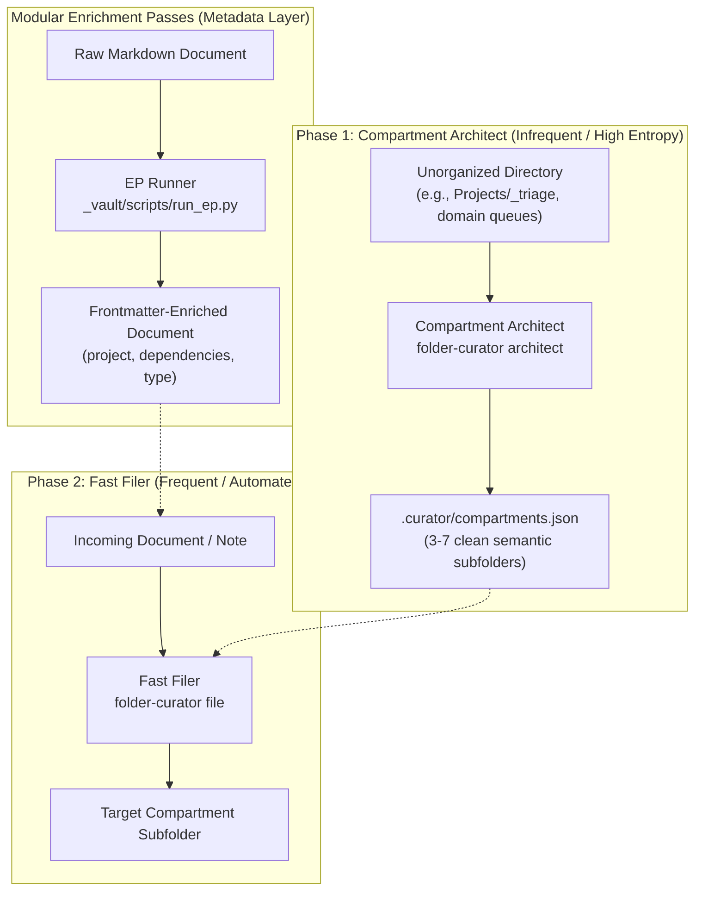

# Folder Curator

Folder Curator provides two complementary layers of organization for directories and documents:
1. **Spatial Curation (Two-Phase Folder Curator)**: Organizes files into clean, semantic subdirectories based on discovered compartment contracts.
2. **Metadata Enrichment (Document Enrichment Passes)**: Decorates YAML frontmatter with standardized metadata (`project`, `dependencies`, `type`, `summary`) before or alongside spatial routing.

---

## 1. Operating Architecture



---

## 2. CLI Reference

The installed CLI executable is `folder-curator` (on `PATH` via `~/.local/bin/folder-curator`).

### Spatial Curation Commands

```bash
# 1. Discover semantic compartments for an unorganized folder (Phase 1)
folder-curator architect "Projects/<repo>"
folder-curator architect "Projects/<repo>" --dry-run

# 2. File all loose documents in the directory into its compartments (Phase 2)
folder-curator file "Projects/<repo>"
folder-curator file "Projects/<repo>" --dry-run

# 3. Preview routing for a single file (read-only plan)
folder-curator plan "Projects/<repo>/note.md"

# 4. Route a single file into its compartment
folder-curator apply "Projects/<repo>/note.md"
```

### Frontmatter Metadata Enrichment Passes (EPs)

DeLoDocs adopts the universal Document Enrichment Pass contract (`wax.ep.v1` / `create-enrichment-pass`):
Passes are side-effect-free, take `DOCUMENT_PATH`, and emit declarative JSON frontmatter proposals.

```bash
# Preview pjangler project classification (doc belongs to 1 primary project, others as dependencies)
python3 _vault/scripts/run_ep.py "Projects/<repo>/note.md" --pass project-classifier

# Atomically apply proposed frontmatter to the document (with no-clobber protection)
python3 _vault/scripts/run_ep.py "Projects/<repo>/note.md" --pass project-classifier --apply
```

---

## 3. Daemon & n8n Integration

`folder-curator serve` runs continuously under systemd as `curator-serve.service` on `http://127.0.0.1:8787`.

Supported HTTP endpoints:
- `GET /health` — Service health check.
- `POST /architect` — Discover compartments for a directory:
  ```json
  { "directory": "Projects/_triage", "dry_run": false }
  ```
- `POST /file` — Route files in a directory into compartments:
  ```json
  { "directory": "Projects/_triage", "file": "optional.md", "dry_run": false }
  ```
- `POST /plan` & `POST /apply` — Legacy compatibility endpoints for the installed `n8n-nodes-folder-curator` custom node:
  ```json
  { "file": "/absolute/path/to/note.md", "client_root": "/path/to/dir" }
  ```

Importable n8n workflow template: `_vault/Workflows/n8n/folder-curator-v2.json`.

---

## 4. Safety Guardrails

- **No Data Loss / Safe Holding:** Low-confidence items (< 0.70 confidence) or items not matching any compartment are held in place rather than moved into an arbitrary folder or deleted.
- **No-Clobber Frontmatter:** Human-authored frontmatter keys are never overwritten by automated passes without explicit authorization.
- **Protected Keys:** System provenance keys (`vault-id`, `captured`, `created_at`, `source`, `source-sha256`) are immutable.
- **Inference Optimization:** Routes through the AutomaticAI gateway (`https://api.automaticai.io/v1`) using subscription-backed models (`kimi-k3s`) with zero incremental metered billing.
